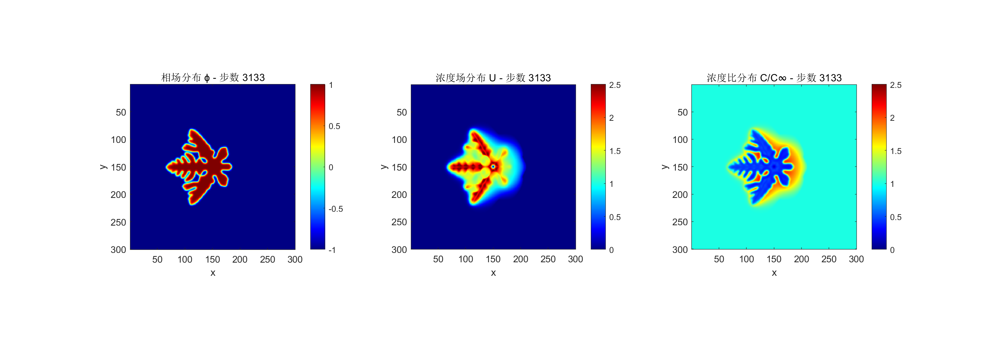
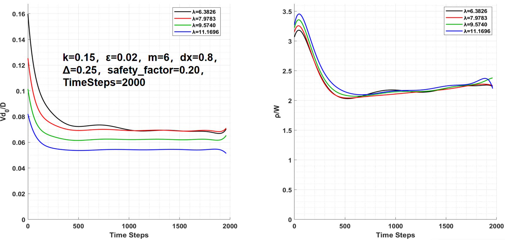

**⭐ If you find this code useful for your research or interesting, please consider giving it a star! and share with your friends**
**⭐ 如果本代码对您的研究有帮助或者觉得有意思，请考虑点个星支持一下！并与朋友分享**

**🎓 This code is not just for research - it's also fascinating to watch dendrites grow in real-time!**
**🎓 本代码不仅用于研究 - 实时观察枝晶生长的过程也非常有趣！**
**Whether you're a materials science student, a physics enthusiast, or just curious about pattern formation, watching six-fold symmetric dendrites grow from a tiny seed is mesmerizing.**
**无论您是材料科学学生、物理爱好者，还是只是对图案形成感到好奇，观看六重对称枝晶从微小晶核生长的过程都令人着迷。**

**🔔 Watch this repository for updates and new features**
**🔔 关注本仓库以获取更新和新功能**
**🚀 COMING SOON: CUDA-based GPU parallelization for massive speedup!**
**🚀 即将到来：基于CUDA的GPU并行计算，大幅提升计算效率！**
**We're actively working on a GPU-accelerated version that will leverage NVIDIA CUDA for 10-100x faster simulations. Stay tuned!**
**我们正在积极开发GPU加速版本，将利用NVIDIA CUDA实现10-100倍的计算加速。敬请期待！**

# Concentration-Phase Field Method for Dendritic Growth
# 浓度-相场法枝晶生长模拟

An educational Concentration-phase-field method implementation perfect for PFM beginners to learn detailed simulation techniques. Based on the anisotropic Allen-Cahn equation, solved using finite difference method (forward Euler in time, five-point central difference in space), implementing dimensionless phase-field method with rigorous concentration-field coupling for six-fold / four-fold symmetric dendritic growth in binary alloy solidification.
适合浓度相场法(PFM)入门新手详细学习的教育性实现。基于各向异性的Allen-Cahn方程，利用有限差分法实现（时间向前差分，空间五点中心差分），实现了相场-浓度场耦合的无量纲相场法，用于模拟二元合金中六重 / 四重对称枝晶生长。

**Key Features for Learning** | **学习要点**:
- Clear finite difference discretization | 清晰的有限差分离散化
- Explicit time integration scheme | 显式时间积分格式
- Modular code structure for easy understanding | 模块化代码结构便于理解
- Bilingual comments (Chinese/English) | 双语注释（中文/英文）

## Example Videos and Images | 示例视频与图片

### Example 1: Basic Dendritic Growth | 基础枝晶生长


*Video: [basic_growth_combined.mp4](examples/videos/basic_growth_combined.mp4) | Combined view of phase, concentration, and C/C∞ fields*

Six-fold symmetric dendrite growing from a central seed. The video shows simultaneous evolution of three fields in subplots.
六重对称枝晶从中心晶核生长。视频在子图中展示三个场的同时演化。

### Example 2: Velocity Field Effects | 速度场影响


*Videos: [velocity_field_combined.mp4](examples/videos/velocity_field_combined.mp4) | Combined fields, [velocity_field_contour.mp4](examples/videos/velocity_field_contour.mp4) | Streamlines with velocity magnitude background*

Dendrite growing under uniform flow (forced convection). The flow breaks the six-fold symmetry and creates asymmetric growth patterns:
- **Upstream side** (迎流侧): Fresh fluid brings lower solute concentration → **Faster growth**
- **Downstream side** (顺流侧): Solute accumulates → Higher concentration → **Slower growth**
均匀流场（强制对流）下的枝晶生长。流场破坏六重对称性，产生非对称生长模式：
- **迎流侧** (Upstream): 新鲜流体带来较低溶质浓度 → **生长更快**
- **顺流侧** (Downstream): 溶质堆积 → 浓度较高 → **生长更慢**

### Parameter Dependence | 参数依赖性


*Tip curvature radius and growth velocity as functions of material parameters*

Tip curvature radius and growth velocity vary with λ
尖端曲率半径和生长速率随λ变化

### Troubleshooting Guide | 问题排查指南

If you encounter errors, bugs, or unphysical phenomena:
如果您遇到报错、bug或非物理现象：

**Step 1**: Check [Known Limitations | 已知限制](#known-limitations--已知限制-) ⭐
- Many issues are documented here with solutions
- 许多问题都有记录和解决方案

**Step 2**: Check [Common Issues | 常见问题](#common-issues--常见问题)
- Quick fixes for frequent problems
- 常见问题的快速修复方法

**Step 3**: Check [Velocity Field Physical Limitations | 速度场物理限制](#velocity-field-physical-limitations--速度场物理限制-) ⭐
- Important notes about velocity field implementation
- 关于速度场实现的重要说明

**Step 4**: Report on [GitHub Issues](https://github.com/pavedplaza/phase-field-dendrite-basic/issues)

## Table of Contents | 目录

- [Basics | 基础](#basics--基础)
  - [Quick Start | 快速开始 ⭐](#quick-start--快速开始-)
  - [Common Issues | 常见问题](#common-issues--常见问题)
  - [Project Structure | 项目结构](#project-structure--项目结构)
  - [Theory Background | 理论背景](#theory-background--理论背景)
  - [Default Parameters | 默认参数](#default-parameters--默认参数)
  - [Physical Units | 物理单位](#physical-units--物理单位)
  - [Visualization & Output Recommendations | 可视化与输出建议](#visualization--output-recommendations--可视化与输出建议)
- [Advanced | 进阶](#advanced--进阶)
  - [Video Output Configuration | 视频输出配置](#video-output-configuration--视频输出配置)
  - [Velocity Field Physical Limitations | 速度场物理限制 ⭐](#velocity-field-physical-limitations--速度场物理限制-)
  - [Known Limitations | 已知限制 ⭐](#known-limitations--已知限制-)
  - [Initial Seed Configuration | 初始晶核配置](#initial-seed-configuration--初始晶核配置)

---

## Basics | 基础

### Quick Start | 快速开始 ⭐

#### 3 Steps to Run | 三步运行

**Step 1**: Download project | 下载项目
```bash
git clone https://github.com/pavedplaza/phase-field-dendrite-basic.git
cd phase-field-dendrite-basic
```

**Step 2**: Open MATLAB and add to path | 打开MATLAB并添加到路径
```matlab
cd 'path/to/phase-field-dendrite-basic'
addpath(genpath('.'))
```

**Step 3**: Run simulation | 运行模拟
```matlab
% Method 1: Use main script (recommended for beginners)
run('phase_field_simulation.m')

% Method 2: Use function interface (flexible configuration)
params = config_default();
run_simulation(params);
```

**✅ That's it! Wait for simulation to complete (very soon)**
**✅ 就这样！等待模拟完成（很快）**

Results will be saved in `simulation_data.mat` with analysis plots generated.
结果将保存在 `simulation_data.mat`，并生成分析图。

### Common Issues | 常见问题

1. **Running too slowly**: Set `params.visualization = false`
**运行太慢**: 设置 `params.visualization = false`
2. **Has 'enable_resampling = true' not taken effect?**: `enable_resampling` only takes effect when `tip_tracking = true`
**enable_resampling = true没有生效？**: `enable_resampling`仅在`tip_tracking = true`时生效

---

### Project Structure | 项目结构

This section explains the main files and core functions in the project.
本节说明项目中的主要文件和核心函数。

#### Main Programs | 主程序

**`run_simulation.m`** - Main simulation function
**主模拟函数**
- Core simulation loop with time integration
  核心模拟循环与时间积分
- Handles all physics calculations (phase field, concentration field, velocity field)
  处理所有物理计算（相场、浓度场、速度场）
- Manages data saving and visualization
  管理数据保存和可视化
- **Usage**: `results = run_simulation(params);`
  **使用方法**: `results = run_simulation(params);`

**`config_default.m`** - Default parameter configuration
**默认参数配置**
- Sets all simulation parameters (material properties, numerical settings, boundary conditions)
  设置所有模拟参数（材料属性、数值设置、边界条件）
- Customizable before running simulation
  运行模拟前可自定义
- **Usage**: `params = config_default();`
  **使用方法**: `params = config_default();`

**`phase_field_simulation.m`** - Main script for beginners
**新手主脚本**
- Simple entry point for running simulations
  运行模拟的简单入口
- Automatically loads default config and runs simulation
  自动加载默认配置并运行模拟
- **Usage**: `run('phase_field_simulation.m')`
  **使用方法**: `run('phase_field_simulation.m')`

#### PFM_core Functions | 核心函数

All functions in `PFM_core/` folder handle tip tracking and analysis:
`PFM_core/` 文件夹中的所有函数处理尖端追踪和分析：

**`find_six_tips_direction_specific.m`** - Detect six dendrite tips
**检测六个枝晶尖端**
- Searches for tips along six directions (0°, 60°, 120°, 180°, 240°, 300°)
  沿六个方向搜索尖端（0°、60°、120°、180°、240°、300°）
- Requires: `velocity_field = 'none'`, `m_aniso = 6`, central seed
  要求：`velocity_field = 'none'`，`m_aniso = 6`，中心晶核

**`calculate_six_tip_dynamics.m`** - Calculate tip dynamics
**计算尖端动力学**
- Computes tip position, velocity, curvature radius
  计算尖端位置、速度、曲率半径
- Maintains history buffer for smoothing
  维护历史缓冲区用于平滑

**`calculate_instantaneous_tip_velocity.m`** - Instantaneous tip velocity
**瞬时尖端速度**
- Calculates velocity from tip position changes
  从尖端位置变化计算速度

**`resample_contour_equidistant.m`** - Resample interface contour
**重采样界面轮廓**
- Resamples contour points at equal intervals
  以等间隔重采样轮廓点
- Required for accurate tip velocity calculation
  精确计算尖端速度所必需

**`calculate_contour_line_intersections.m`** - Line-contour intersections
**线-轮廓交点计算**
- Calculates intersection points between search rays and contour
  计算搜索射线与轮廓的交点

**`generate_tip_detailed_analysis.m`** - Generate detailed analysis
**生成详细分析**
- Creates comprehensive tip tracking reports
  创建全面的尖端追踪报告

**`plot_six_tip_dynamics_analysis.m`** - Plot tip dynamics
**绘制尖端动力学**
- Generates analysis plots for tip position, velocity, curvature
  生成尖端位置、速度、曲率的分析图

---

### Theory Background | 理论背景

#### Phase Field Equation | 相场方程

```
∂φ/∂t = ∇·[A(ψ)^2 ∇φ] - ∂/∂x [A(ψ) A(ψ)' ∂φ/∂y] + ∂/∂y [A(ψ) A(ψ)' ∂φ/∂x] + φ(1 - φ^2) - λ(1 - φ^2)^2 (θ + k U)
```

Where | 其中:
- `ϕ` (phi): Phase field (ϕ=1 solid, ϕ=-1 liquid) | 相场（ϕ=1固相，ϕ=-1液相）
- `k`: Partition coefficient | 分配系数
- `λ` (lambda): Coupling constant | 耦合常数
- `ε` (epsilon): Anisotropy strength | 各向异性强度

#### Concentration Field Equation | 浓度场方程

```
[(1+k)-(1-k)φ]/2 * ∂U/∂t = ∇·[ D (1-φ)/2 ∇U + (1+(1-k)U)/(2√2) * (∂φ/∂t) * (∇φ/|∇φ|) ] + ...
```

Where | 其中:
- `U`: Dimensionless concentration | 无量纲浓度
- `D`: Diffusion coefficient | 扩散系数
- `v`: Velocity field | 速度场

#### Anisotropy Function | 各向异性函数

```
ε(θ) = ε₀[1 + δ cos(m(θ - θ₀))]
```

For six-fold symmetry (m=6): | 对于六重对称（m=6）：
- Preferred growth directions at 0°, 60°, 120°, 180°, 240°, 300°
  优先生长方向为0°、60°、120°、180°、240°、300°

---

#### Numerical Method | 数值方法

- **Spatial discretization**: Finite difference with 5-point stencil
  **空间离散化**：五点格式的有限差分
- **Time integration**: Explicit Euler scheme
  **时间积分**：显式欧拉格式
- **Time step**: Calculated based on CFL condition: `dt = safety_factor * dx² / (4D)`
  **时间步长**：基于CFL条件计算：`dt = safety_factor * dx² / (4D)`
- **Boundary conditions**: Periodic or zero-gradient
  **边界条件**：周期性或零梯度

### Default Parameters | 默认参数

#### Material Parameters | 材料参数

| Parameter | Symbol | Default | Description | 描述 |
|-----------|--------|---------|-------------|------|
| Partition coefficient | k | 0.15 | Solute partition coefficient | 溶质分配系数 |
| Anisotropy strength | ε | 0.02 | Strength of anisotropy | 各向异性强度 |
| Anisotropy mode | m | 6 | Mode of anisotropy (6-fold) | 各向异性模数（六重） |
| Coupling constant | λ | 10.0 | Coupling strength | 耦合强度 |
| Diffusion coefficient | D | 6.267 | Dimensionless diffusivity | 无量纲扩散系数 |
| Undercooling | θ | -0.2 | Dimensionless undercooling | 无量纲过冷度 |

#### Numerical Parameters | 数值参数

| Parameter | Default | Description | 描述 |
|-----------|---------|-------------|------|
| Grid size (Nx, Ny) | 300×300 | Grid resolution | 网格分辨率 |
| Spatial step (dx, dy) | 0.8 W | Grid spacing | 网格间距 |
| Total time | 10.0 τ₀ | Simulation duration | 模拟时长 |
| Output interval | 0.5 τ₀ | Data save frequency | 数据保存频率 |

---

### Physical Units | 物理单位

**Important**: This simulation uses **dimensionless phase field method**. All units are normalized:
**重要**：本模拟使用**无量纲相场法**。所有单位均已归一化：

- **Time unit**: `τ₀` (relaxation time) | **时间单位**：`τ₀`（弛豫时间）
- **Length unit**: `W` (interface width) | **长度单位**：`W`（界面宽度）
- `dt` (time step): Default ≈ 0.0064 τ₀ (calculated from CFL condition)
- `dx` (grid spacing): Default = 0.8 W
- Seed crystal radius: Default = 3.2 W

---

### Visualization & Output Recommendations | 可视化与输出建议

#### Scenario 1: Real-time Observation (Visualization Mode)
#### 场景1：实时观察（可视化模式）

```matlab
params.visualization = true;      % Enable real-time display
params.tip_tracking = false;       % Disable tip tracking
params.output_interval = 0.5;      % Larger interval for smooth visualization

% Recommended | 推荐:
% - Grid: 300×300 (faster rendering)
% - Total time: 5-10 τ₀
% - Use: Qualitative observation, demonstrations
% - 用途：定性观察、演示
```

#### Scenario 2: Data Analysis (Non-visualization Mode)
#### 场景2：数据分析（非可视化模式）

```matlab
params.visualization = false;     % Disable visualization for speed
params.tip_tracking = true;       % Enable tip tracking
params.output_interval = 0.01;    % Small interval for high-resolution data

% Recommended | 推荐:
% - Grid: 300×400 or larger
% - Total time: 10-20 τ₀
% - Use: Quantitative analysis, tip velocity measurement, publication
% - 用途：定量分析、尖端速率测量
```

**Why? | 原因**：
- **Tip tracking requires high temporal resolution**: Tip velocity changes rapidly
  **尖端追踪需要高时间分辨率**：尖端速率变化快
- **Visualization is computationally expensive**: Rendering slows down computation
  **可视化计算开销大**：渲染会减慢计算
- **Post-processing plots are always generated**: Even with `visualization=false`
  **后处理图始终生成**：即使`visualization=false`

---

## Advanced | 进阶

### Video Output Configuration | 视频输出配置

The simulation can generate MP4 videos showing the evolution of multiple fields.
本模拟可以生成展示多个场演化的 MP4 视频。

#### How to Enable Video Generation | 如何启用视频生成

```matlab
params = config_default();
params.save_video = true;          % Enable video saving | 启用视频保存
params.video_fps = 10;             % Video frames per second (default: 10) | 视频帧率（默认：10）
params.visualization = true;       % Required: must enable visualization | 必须启用可视化
params.output_interval = 0.5;      % Controls video smoothness | 控制视频流畅度

results = run_simulation(params);
```

**Important | 重要**:
- `save_video` only works when `visualization = true`
  `save_video` 仅在 `visualization = true` 时生效
- Videos are generated after simulation completes (post-processing)
  视频在模拟完成后生成（后处理）
- Video generation does NOT slow down the simulation itself
  视频生成不会减慢模拟本身的速度

#### Output Videos | 输出视频

**For basic growth** (no velocity field | 无速度场):
- `basic_growth_combined.mp4`: Single video with 3 subplots showing:
  单个视频包含3个子图，显示：
  - Phase field (ϕ) | 相场
  - Concentration field (U) | 浓度场
  - C/C∞ field | C/C∞场

**For velocity field simulations** (速度场模拟):
- `velocity_field_combined.mp4`: Combined fields (same as above) | 合并场（同上）
- `velocity_field_contour.mp4`: Velocity field quiver plot with dendrite contour
  速度场箭头图与枝晶轮廓（红色箭头显示流动方向，灰色背景显示相场）

#### Performance Tips | 性能提示

- **Larger `output_interval`** → Fewer frames → Faster video generation, smoother playback
  **更大的 `output_interval`** → 更少帧数 → 视频生成更快，播放更流畅
- **Smaller `output_interval`** → More frames → Higher temporal resolution, slower generation
  **更小的 `output_interval`** → 更多帧数 → 更高时间分辨率，生成更慢
- **Recommended**: `output_interval = 0.5` for good balance
  **推荐**：`output_interval = 0.5` 以获得良好平衡

---

### Velocity Field Physical Limitations | 速度场物理限制 ⭐

**Important**: The current implementation does NOT solve the full Navier-Stokes equations.
**重要**：当前实现**没有求解完整的Navier-Stokes方程**。

This means:
这意味着：

- **All flow types** (uniform, shear, vortex): Use a **simple permeability model** to prevent fluid penetration into solid phase
  **所有流场类型**（均匀流、剪切流、涡旋流）：使用**简单渗透率模型**防止流体穿透固相
  - Velocity in solid phase is set to zero via `(1-φ)²` permeability factor
    固相内速度通过 `(1-φ)²` 渗透率因子设为零

- **Shear flow** (`velocity_field = 'shear'`): Shows a **linear velocity gradient** without proper rotational physics
  **剪切流**（`velocity_field = 'shear'`）：显示**线性速度梯度**，没有正确的旋转物理

- **Vortex flow** (`velocity_field = 'vortex'`): Shows a **simple rotational velocity field** without considering:
  **涡旋流**（`velocity_field = 'vortex'`）：显示**简单旋转速度场**，未考虑：
  - Conservation of angular momentum | 角动量守恒
  - Viscous dissipation effects | 粘性耗散效应
  - Navier-Stokes equations | Navier-Stokes方程

For physically accurate fluid-solid interaction simulations, a full CFD (Computational Fluid Dynamics) implementation with two-way coupling would be required.
对于精确的流固耦合模拟，需要完整的CFD（计算流体力学）实现和双向耦合。

**Recommendation | 建议**:
- Use **uniform flow** (`velocity_field = 'uniform'`) for most studies (simplest approximation)
  大多数研究使用**均匀流**（`velocity_field = 'uniform'`）（最简单的近似）
- The shear and vortex options are provided for **educational demonstrations only**
  剪切流和涡旋选项**仅供教育演示使用**

---

### Known Limitations | 已知限制 ⭐

#### Tip Tracking Constraints | 尖端追踪限制

Six tips are detected using:
六个尖端使用以下方法检测：

1. **Contour extraction**: MATLAB `contour` function at ϕ=0
   **轮廓提取**：在ϕ=0处使用MATLAB `contour`函数
2. **Direction-specific search**: Six rays at 60° intervals
   **方向特定搜索**：间隔60°的六条射线
3. **Intersection calculation**: Ray-contour intersection points
   **交点计算**：射线-轮廓交点
4. **Validation**: Distance and angle deviation checks
   **验证**：距离和角度偏差检查

**Important**: Due to algorithmic limitations, tip tracking (`params.tip_tracking`) currently has **three strict requirements**:
**重要**：由于算法限制，尖端追踪（`params.tip_tracking`）目前有**三个严格要求**：

1. **No velocity field**: Only `velocity_field = 'none'` is supported
   **无速度场**：仅支持 `velocity_field = 'none'`
2. **Six-fold symmetry**: Anisotropy mode must be `m_aniso = 6`
   **六重对称**：各向异性模数必须为 `m_aniso = 6`
3. **Central seed**: Seed crystal must be at domain center
   **中心晶核**：晶核必须位于域中心

```matlab
% ✅ CORRECT: Tip tracking with all requirements met
% ✅ 正确：尖端追踪（满足所有要求）
params.tip_tracking = true;
params.velocity_field = 'none';       % Only 'none' is supported
params.m_aniso = 6;                   % Must be 6 for six-fold symmetry

% ❌ INCORRECT 1: Tip tracking with velocity field (NOT SUPPORTED)
% ❌ 错误1：尖端追踪（带速度场）（不支持）
params.tip_tracking = true;
params.velocity_field = 'uniform';    % Will cause errors

% ❌ INCORRECT 2: Tip tracking with wrong anisotropy mode (NOT SUPPORTED)
% ❌ 错误2：尖端追踪（错误的各向异性模数）（不支持）
params.tip_tracking = true;
params.m_aniso = 4;                   % Must be 6, not 4
```

**Why | 为什么**：
- The tip detection algorithm assumes **six-fold symmetric growth from a central seed**
  尖端检测算法假设**从中心晶核进行六重对称生长**
- **Velocity fields break this symmetry**, making tip detection unreliable
  **速度场破坏这种对称性**，使尖端检测不可靠
- **Seed must be at domain center** for the angle-based tip detection algorithm
  **晶核必须在域中心**，基于角度的尖端检测算法才能工作

---

### Initial Seed Configuration | 初始晶核配置

**Fixed assumptions | 固定假设**：
- Seed crystal is **always initialized at the domain center**
  晶核**始终在域中心初始化**
- Growth pattern is **six-fold symmetric** (by default, `params.m_aniso = 6`)
  生长模式为**六重对称**（默认，`params.m_aniso = 6`）
- Seed radius: Default = 3.2 W
  晶核半径：默认 = 3.2 W

**To modify these assumptions**, you would need to:
**要修改这些假设**，您需要：
1. Change the seed initialization in `run_simulation.m` (lines ~160-180)
2. Update the tip detection algorithm in `PFM_core/detect_six_tips.m`
3. Adjust target angles in `params.six_tip_angles` (default: 0:60:300 degrees)

**Recommendation | 建议**：
- For tip tracking studies: Always use `params.velocity_field = 'none'`
  对于尖端追踪研究：始终使用 `params.velocity_field = 'none'`
- For velocity field studies: Disable tip tracking (`params.tip_tracking = false`)
  对于速度场研究：禁用尖端追踪（`params.tip_tracking = false`）

---

---

**Last Updated | 最后更新**: 2026-02-11

**Maintainer | 维护者**: pavedplaza <2300837983@qq.com>

**Affiliation | 所属机构**: China Zhejiang University(ZJU) And Chongqing University(CQU)